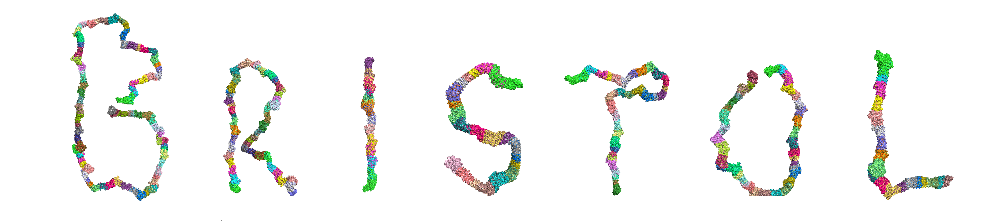
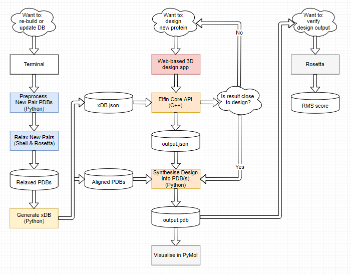

# Elfin (v1: End of Master's Project Snapshot)
Elfin is a computational protein design tool based on repeat protein module construction. A journal paper in Structural Biology describing this work has been submitted for review. A more detailed explanation of how Elfin works can be found [here](https://github.com/joy13975/elfin-thesis). 


Figure 1: the handwritten word "Bristol" drawn using protein modules, assembled by Elfin's GA. The visualisation was created using PyMol.

The main idea of Elfin is to use repeat proteins as rigid construction modules (much like how Lego works) and build 3D shapes that are as close to the user's input description as possible. Major contributors to this work are: Joy Yeh (UoB), Fabio Parmeggiani (UoB), TJ Brunette (UoW), David Baker (UoW), and Simon McIntosh-Smith (UoB).

* UoB: University of Bristol
* UoW: University of Washington

### Access to elfin-db: 
Elfin requires a repeat protein database called "elfin-db", which contains PDB files of the protein modules. This can be acquired from [this](https://github.com/joy13975/elfin-db) repository. Access should be asked from fabio.parmeggiani@bristol.ac.uk (Fabio). The reason for restricted access is that these files are unpublished laboratory results (from the Baker lab of the University of Washington). Without these module PDBs, Elfin can still run but will not produce PDB outputs - only module centre-of-mass information.

The old repository with the complete change history is [here](https://github.com/joy13975/elfin-old). Files were migrated to this new repository to get rid of massive pack files that git was creating. Grid search files can be found [here](https://github.com/joy13975/elfin-gridsearch).

### Content:
1. [Prerequisites](#1-prerequisites)

2. [Optional Tools](#2-optional-tools)

3. [Project Status](#3-project-status)

4. [Repository Setup](#4-repository-setup)

5. [Python Setup](#5-python-setup)

6. [GA Setup](#6-ga-setup)

7. [Usage](#7-usage)

8. [Input Creation](#8-input-creation)

9. [Database Preparation](#9-database-preparation)

10. [Design Verification](#10-design-verification)

## 1. Prerequisites
1. [Python 2.7.9](https://www.python.org/downloads/release/python-279/)
2. [VirtualEnv](https://virtualenv.pypa.io/en/stable/) for separation of python environment

## 2. Optional Tools
1. [PyMOL](https://www.pymol.org) for 3D visualisation of PDB and CSV
2. [Rosetta](https://www.rosettacommons.org/software/license-and-download) for minimisation and relaxation.
3. [Matlab](https://www.mathworks.com/products/matlab.html) to specify shape input for Elfin.

## 3. Project Status

**Features**

Version 0.0.1
- [x] Allows user to draw simple shapes in Matlab to describe the protein they want to make
- [x] Accepts input as an array of 3D points specified by either a JSON or CSV file
- [x] Scripts for generating database (in case of new modules)
- [x] Produces quality protein designs
- [x] Several tunable parameters in the GA
- [x] Scripts for design verification (against relaxed versions) with the help of Rosetta 

Version 0.0.2
- [ ] Migrate from PDB to CIF (mainly due to atom number limit but also that PDB has been phased out in 2016)
- [ ] Implement N and C terminal capping in Synthesiser
- [ ] Accept input as a network of points with connections between 
   - [ ] Check sanity of input
- [ ] Produce quality protein designs for simple, tree-like shapes
   - [ ] Produce quality protein designs for complex, cyclical shapes
- [ ] Allow multi-chain option in Synthesiser
- [ ] Improve GPU performance (?)


- Blue: implemented
- Yellow: implemented but possibly needs modification for upcoming new features
- Orange: implemented but definitely needs modification for upcoming new features
- Red: not yet implemented but planned

**Optimisations**

I performed a rather straight forward port to OpenMP 4.0, with several algorithm optimisations described in my thesis. This is because nearly all of the time in this project was allocated to designing the underlying algorithms (scoring and mutating), and ensuring that they were efficient and effective. There was no time to transform the **entirely newly developed** code into a compact, performant kernel and at the same time ensure that it produces the correct results. 

Nevertheless, the GA code is multi-threaded by default, and in fact scales fairly well. Code that controls parallel behaviours are currently in ```./GA/core/ParallelUtils.cpp``` and ```./GA/core/ParallelUtils.hpp```. As detailed in my thesis, the algorithm optimisations have made significant improvements to the GA's speed. Being the first application of its kind, it is quite difficult to judge how fast/efficient Elfin is without extensive performance instrumentation.

Regarding the GPU port: minimum changes were made to the GA to make it run on GPUs. Again, if there was more time this would be an interesting route of research as the GA is a very parallel workload. Making Elfin's GA run fast on GPUs may be a way towards interactive design for massive protein structures. 

The GPU port has only been tested on the Bristol Zoo cluster, which has the ```llvm/clang-ykt-sm_xx``` compiler to support OpenMP 4.0+. If you have access to the Zoo, load the modules ```llvm/clang-ykt-sm_61``` and ```cuda/8.0.44```, and do:

```
make TARGET=gpu
```

This should compile Elfin GA for targeting GPUs. The flag ```--device``` can be used to specify device ID to run the GA on. The rest of the usage are the same.

## 4. Repository Setup

```
git clone https://github.com/joy13975/elfin.git
cd elfin                                                #you should now be at repository root
```

## 5. Python Setup

```
                                                        #you should be at repository root
virtualenv --python=<path/to/your/python-2.7.9> venv    #the name 'venv' is required
. ./activate                                            #activate the virtual environment
pip install -r requirements.txt                         #install required libraries locally
```

## 6. GA Setup

First you need GCC/G++ 5 and above. On Macs for instance, you can get OpenMP-enabled GCC-6 by simply installing from Homebrew:

```
brew install gcc --without-multilib
```

The installation could take a while. After this is done, you should get commands ```gcc-6``` and ```g++-6```. You can choose to make these your default compilers by overwriting the symbolic links at ```/usr/local/bin/gcc``` and ```/usr/local/bin/g++```:
```
ln -Fs `which gcc-6` /usr/local/bin/gcc
ln -Fs `which g++-6` /usr/local/bin/g++
```

For troubleshooting on MacOS, please refer to [this](https://stackoverflow.com/questions/35134681/installing-openmp-on-mac-os-x-10-11) Stackoverflow post. 

If your compiler complains about ```omp_get_initial_device``` not declared, that's because your OpenMP version is too old. Check with ``` echo |cpp -fopenmp -dM |grep -i open```; only versions above 201511 seem to define this function. This is not vital to the application so if you really do not want to install a newer compiler then you may comment out that erring line.

Then get ready to compile.

```
cd GA                                                   #you should now be at ./GA/
make
```

Notes:
 - Specify the compiler of your choice by e.g. for clang++: ```make CXX=clang++```.
 - For clang, you will need to specify the C++ standard library include path, which depends on where you installed GCC. See ./GA/Makefile for details (the INCS variable). You will also need to include libiomp and library load paths (again see Makefile).
 - To speed up the compilation, use the -j flag with the number of cores on your system.
 - To build without OpenMP, you can specify ```make OMP=no```

## 7. Usage
Once you have compiled the GA successfully, you can test run it with:
```
                                                        #you should be at ./GA/
./bin/elfin                                             #this invokes the default configuration
```

The default configuration is at ```./GA/config.json``` and uses the ```./bm/l10/1696.json``` example input. This demonstrates that the GA finds the zero score solution i.e. the original module constituents of the input. Execution outputs will be stored in ```./GA/output/``` in JSON format (files named after their memory addresses). You can specify the output directory using the ```-o``` flag. Even if you force Elfin to stop using ctrl-c, the most recent best candidates will be saved.

To test a different example, you may try:

```
./bin/elfin -i ../bm/l20/mqj2.json
```

All examples in ```./bm/l10```, ```./bm/l20``` and ```./bm/l30``` should reach score zero before the maximum number of iterations (default=1000) is exhausted. However, because the random number generator might behave differently on your machine, in some rare cases Elfin might not reach score zero. If this happens, try using larger population sizes e.g. using the ```-gps``` flag.

To get help:
```
./bin/elfin -h
```

A typical Elfin run with specific population size and input file would be:
```
./bin/elfin -gps <POPULATION_SIZE> -i <INPUT_FILE>
```

Notes:
 - Typically, the lower memory address names of output JSONs are the better solutions (lower score).
 - Command-line arguments will override arguments specified in the configuration file.

## 8. Input Creation
Specifying the design shape requires Matlab. The script for doing so is ```./scripts/Matlab/drawPoints.m```. By running the script in Matlab you will be able to plot a series of points in 2D on a Matlab plot. 

After you are done plotting, hit Enter. The 3D coordinates of your shape will be printed in Matlab's command window after being correctly scaled to atomic distances. Adjust those points to achieve 3D depth effects. I admit that this is far from perfect nor is it very easy to use, but for this project it was sufficient. It is part of the future plan to develop something more convenient and expressive.

After acquiring the 3D coordinates, copy them to a CSV file and ensure the formatting is exactly the same as existing CSV spec files, e.g. ```./bm/fun/B.csv```.

## 9. Database Preparation

**Obtain and decompress elfin-db.zip**
```
                                                        #you should be at repository root
. ./activate                                            #make sure venv is active
cd res
git clone https://github.com/joy13975/elfin-db.git 
unzip elfin-db/db.zip                                   #module PDBs are now at ./res/db/
```

Read [here](#access-to-elfin-db) about elfin-db access permission.
If you're not interested in knowing how to generate the abstract module database, simply decompress the aligned module folder:
```
unzip elfin-db/aligned.zip
```


**Preprocess and relax module PDBs**
```
cd ..                                                   #go back to repo root
./scripts/Python/PreprocessAllPDBs.py                   #fix junction pair loop interfaces 
                                                        #now there should be a ./res/proprocessed folder

./scripts/Shell/dbRelaxList.sh > dbRelaxList.sh         #prepare db relaxation command list

```

Now, if you're on a Linux cluster **that has MPI-enabled Rosetta installed** and you have the ```sbatch``` command for your job queuing system, you can simply invoke:

```
sh dbRelaxList.sh
```

If you are on your own computer or some other different environment, you need to modify the environment variables that specify what flavour of Rosetta and queuing system you use. For instance, on my Macbook Pro (without MPI Rosetta and no queuing system) I use:
```
local=yes variant= release=macosclangrelease sh dbRelaxList.sh
```

 - The ```local``` variable tells the ```./scripts/Shell/relax.sh``` script whether or not to use ```sbatch```.
 - The ```variant``` variable tells which build variant (e.g. ```mpi``` or ```none``` if default) of Rosetta to use. 
 - The ```release``` variable tells which release version to use. This depends on your OS, and which build version you want to use (e.g. could be the debug version).

This relaxation can take quite a while simply because the process is computationally intensive. It is therefore strongly recommended that you do this on a compute cluster that lets you spread workload across many machines. 

**Generating the xDB**

After relaxation, you should see a new PDB suffixed with ```_0001.pdb``` for each PDB in ```./res/preprocessed/```. These are the relaxed versions of the original preprocessed PDBs. Now copy these into a separate folder for the next step:
```
./scripts/Shell/copyRelaxedPDBs.sh
```

Lastly, invoke the ```./scripts/Python/GenXDB.py``` script. This script aligns each pair's reference frames to the reference frame of their first single module (e.g. ```D4-D4_j1_D64``` would be superimposed onto ```D4```), producing the ```./res/aligned/``` folder. This folder contains aligned singles and pairs that will be used to reconstruct Elfin's output structures in the final stage of design. Geometric relationships will also be calculated to produce a ```./res/xDB.json``` "pair relationship database".
```
./scripts/Python/GenXDB.py
```

## 10. Design Verification
After running a shape design through Elfin's GA, you should find output solutions in ```./GA/output/```. Recall that smaller hexadecimal values in the file name corresponds to better solutions (they're just memory address of a sorted array). Here we shall use the default input as example.

```
for f in `ls output`; do echo $f; break; done           #print best solution file name
                                                        #take for instance 0x10e63c000.json
cd ..                                                   #go back to repo root		
```
Inspect the output file to see what it contains (score and module/node names). The score is the Kabsch "simularity" score between the solution and the input shape. The lower this score is, the better the solution.

**PDB Reconstruction**

Now, reconstruct the output protein structure using the ```./scripts/Python/Synth.py``` script, which makes use of files in ```./res/aligned/```.
```
./scripts/Python/Synth.py ./GA/output/0x10e63c000.json
```

After this is done you should find a file called ```./GA/output/0x10e63c000_Synth_Main_s1.0_l10.pdb``` with the prefix filename substituted appropriate to your best solution filename. You can ignore the "s1.0", which just means it's using scale of 1.0 but in the Synth.py there is really no scaling involved - it's just a format used to differentiate where this solution came from. One example is the greedy algorithm script ```./scripts/Python/Greedy.py```, which produces output files that also use this format, but may involve some scaling. The "l10" means this solution is 10 single modules long.

You should also find ```./GA/output/0x10e63c000_Synth_Main_s1.0_l10.csv```, which is just the solution coordinates exported in CSV format. This is mainly used to plot module centre-of-masses in PyMOL.

**Visualisation**

At this point, you can already visualise the design outputs in PyMOL by loading the synthesised PDB. You can also plot the solution centre-of-mass points (stored in the CSV output mentioned above). In PyMOL: load the plotting script from ```./scripts/PyMolUtils/LineUtils.py```. Then, type the following in the command window:
```
draw_csv('path/to/your/csv/file')                       #to plot any CSV 3D point file
draw_json('path/to/your/json/file')                     #to plot JSON files that have a 'coms' 3D point array
```

More plotting options can be found by reading the script ```./scripts/PyMolUtils/LineUtils.py```. Note that the default plotting color is black, so you must do ```bg white``` to see them properly. Also note that input specification CSV files can be plotted using the same command.

**Calculating Global RMSD**

To compute the RMSD, we first need to relax the result PDB. This is the same as when we relaxed databse PDBs:

```
./scripts/Shell/relax.sh </path/to/PDB/for/relaxation>
```

Apply the same environment variable changes as needed (mentioned in section 6).
The relaxation of larger structures will take longer (much much longer than DB modules). Using our previous example (on ```./bm/l10/1696.json```) we should yield a file called ```./GA/output/0x10e63c000_Synth_Main_s1.0_l10_0001.pdb``` and ```./GA/output/0x10e63c000_Synth_Main_s1.0_l10_0001_relax.sc```. 

The first file is the relaxed PDB structure, and the second is the score file that contains information about how different the structures are before and after relaxation. To get a Rosetta RMSD estimate (global), open the score file and look at the second column. In this case, I got 2.424.

In the score file the first row is the column headers. Each subsequent row denotes values obtained from each subsequent Rosetta transformation of the structure in question. It is useful to divide the global RMSD by the number of modules in the design to get a more unbiased perspective of RMSD per module. This is because lever effect is obviously much more pronounced in longer/larger protein designs.

**Calculating Windowed RMSD**

Ensure that you have a relaxed result PDB first. To compute the windowed RMSD, invoke:
```
./scripts/Python/RMSDStat.py <solutionDir> <minimisedDir> <windowLen=300> <overlapRatio=0.50> <warnThreshold=5.0>
```

Before you can run this script, copy the relaxed (or minimised) PDBs you want to compare into a different folder - one which the script shall treat as ```<minimisedDir>```. For each relaxed/minimised PDB in this folder, the script will compute a windowed RMSD with respect to their original structure (should exist in ```<solutionDir>```) before the Rosetta transformation.

For instance if we run this on our example output:
```
mkdir ./tmp                                             #make a temporary folder in repo root
cp ./GA/output/0x10e63c000_Synth_Main_s1.0_l10_0001.pdb ./tmp 
./scripts/Python/RMSDStat.py ./GA/output ./tmp          #invoke the windowed RMSD script
```

The output indicated:
```
avg: 1.37087369713 min 0.979476939189 max 1.65581158797
```

Which is consistent with the result in my thesis (for benchmark ```./bm/l10/1696.json```).

