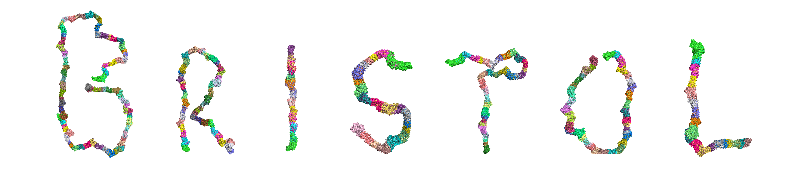

# Elfin
Elfin is a computational protein design tool based on repeat protein module construction. A journal paper (Structural Biology) describing this work has been submitted for review. A more detailed explanation of how Elfin works can be found [here](https://github.com/joy13975/elfin-thesis). 


Figure 1: the handwritten word "Bristol" drawn using protein modules, assembled by Elfin's GA. The visualisation was created using PyMol.

The main idea of Elfin is to use repeat proteins as rigid construction modules (much like how Lego works) and build 3D shapes that are as close to the user's input description as possible. Major contributors to this work are: Joy Yeh (UoB), Fabio Parmeggiani (UoB), TJ Brunette (UoW), David Baker (UoW), and Simon McIntosh-Smith (UoB).

* UoB: University of Bristol
* UoW: University of Washington

**Important**: Elfin requires a repeat protein database called "elfin-db", which contains PDB files of the protein modules. This can be acquired from the joy13975/elfin-db repository. Access should be asked from fabio.parmeggiani@bristol.ac.uk (Fabio). The reason for restricted access is that these files are unpublished laboratory results (from the Baker lab of the University of Washington).

The old repository with the complete change history is [here][https://github.com/joy13975/elfin-old]. Files were migrated to this new repository to get rid of massive pack files that git was creating. Grid search files can be found [here](https://github.com/joy13975/elfin-gridsearch).

### Content:
1. [Repository Setup](#repo-setup)

2. [Python Setup](#python-setup)

3. [GA Setup](#ga-setup)

4. [Usage](#usage)

## Pre-requisites [](#pre-requisites)
1. Python 2.7.9
2. [VirtualEnv](https://virtualenv.pypa.io/en/stable/) for separation of python environment

## Optional Tools [](#optional-tools)
1. [PyMol](https://www.pymol.org) for 3D visualisation of PDB and CSV
2. [Rosetta](https://www.rosettacommons.org/software/license-and-download) for minimisation and relaxation.
3. [Matlab](https://www.mathworks.com/products/matlab.html) to specify shape input for Elfin.

## Repository Setup [](#repo-setup)

```
git clone https://github.com/joy13975/elfin.git
cd elfin                         #you should now be at repository root
git submodule init
git submodule update
cd res
unzip elfin-db/db.zip
```

## Python Setup [](#python-setup) 

```
#you should be at repository root
virtualenv venv                  #the name 'venv' is required
. ./activate                     #activate the virtual environment
pip install -r requirements.txt  #install the libraries needed (locally)
```

## GA Setup [](#ga-setup)

```
cd GA                            #you should now be at ./GA/
make
```

Notes:
 - You can specify your compiler of choice by e.g. for clang++: ```make CXX=clang++```.
 - For clang, you will need to specify the C++ standard library include path, which depends on where you installed GCC. See ./GA/Makefile for details (the INCS variable).
 - For clang, you also need to include libiomp and library load paths specified (again see Makefile).
 - To speed up the compilation, use the -j flag with the number of cores on your system.
 - To build without OpenMP, you can do ```make OMP=no```

## Usage [](#usage)
Once you have compiled the GA successfully, you can test run it with:
```
#you should be at ./GA/
./bin/elfin
```
Make sure that you are in ./GA/.

To get help:
```
./bin/elfin -h
```

Normally you would use Elfin like this:
```
./bin/elfin -gps <POPULATION_SIZE> -i <INPUT_FILE>
```

Notes:
 - Default configuration is in ./GA/config.json. 
 - Command-line arguments will override arguments specified in the configuration file.
